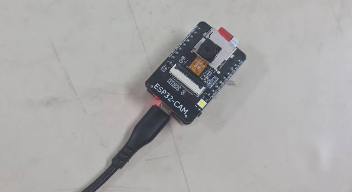
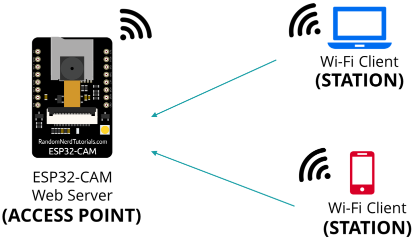
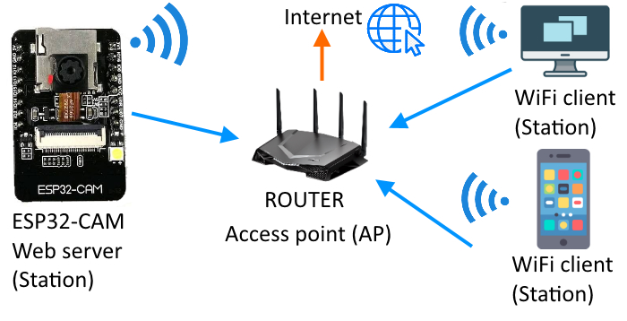
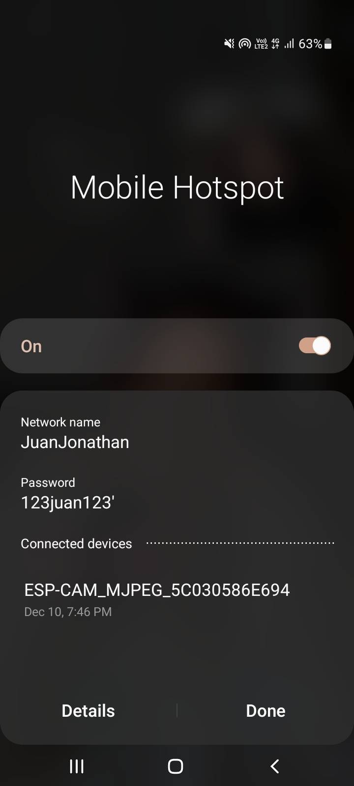
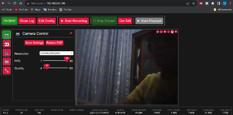
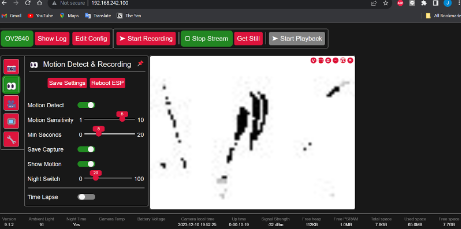
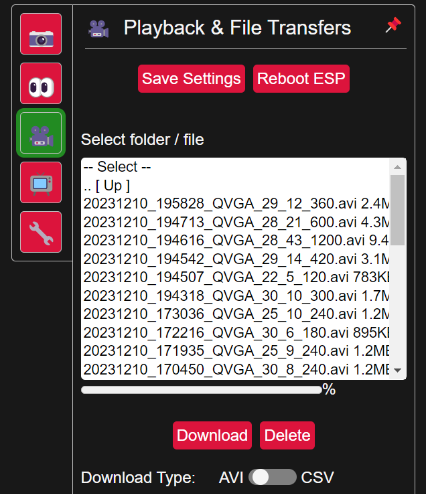
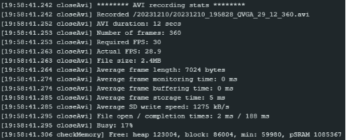

# ESP32-CAM CCTV

## Introduction to the Problem and the Solution
This project is a CCTV system utilizing the AI Thinker ESP32-CAM module. Inspired by [ESP32-CAM_MJPEG2SD](https://github.com/s60sc/ESP32-CAM_MJPEG2SD), our solution enhances the capabilities of the ESP32-CAM, providing a feature-rich web-based interface for remote streaming, recording, and configuration.

## Hardware Design and Implementation Details

- The project utilizes the AI Thinker ESP32-CAM module for capturing and processing video.
- Motion detection is implemented using light based frame processing for accurate and efficient triggering.
- An SD Card is employed for storage, accommodating recorded videos, web browser HTML files, and configuration data.
- Configurable settings such as image quality, motion detection sensitivity, and Wi-Fi credentials are stored in the ESP32's Non-Volatile Storage (NVS).

## Network Infrastructure
The CCTV system operates on a local network, allowing users to access the web interface from any device with a browser.

When no valid SSID and password can be found, the CCTV acts as an access point which then users can connect to the CCTV and access it directly.

The user can access the browser interface using the local IP 192.168.4.1 which then users can configure a valid SSID and password. Once a valid SSID and password have been configured, the CCTV will then operate as a station to the router. Hosts on the same network can then access the browser UI.

Router SSID and password, as well as the WhatsApp number and API Key for alerts, are configurable through the web interface.

## Software Implementation Details
The web-based interface provides a user-friendly experience for streaming, recording, and configuring the CCTV remotely. Image quality settings are adjustable directly from the browser, offering flexibility to users.

Motion detection features automatically initiate recording and send alerts via WhatsApp, with configurable sensitivity settings.

The ESP32-CAM can browse the SD Card file system, enabling users to view, playback, and download recorded footage.

## Test Results and Performance Evaluation
The system undergoes rigorous testing to ensure reliable performance in various scenarios. Motion detection sensitivity, image quality, and alert functionality are evaluated to guarantee optimal functionality.

## User Guide

## Conclusion and Future Work
- The ESP32-CAM CCTV project provides an accessible and versatile solution for home surveillance.
- Future enhancements may include additional AI-based features, cloud integration, and improved user interfaces.
- Contributions and feedback from the community are welcomed for continuous improvement and innovation.

## Contributors
- [juanjonathan67](https://github.com/juanjonathan67) 
- [Jordinia](https://github.com/Jordinia)
- [nevandaa](https://github.com/nevandaa)
